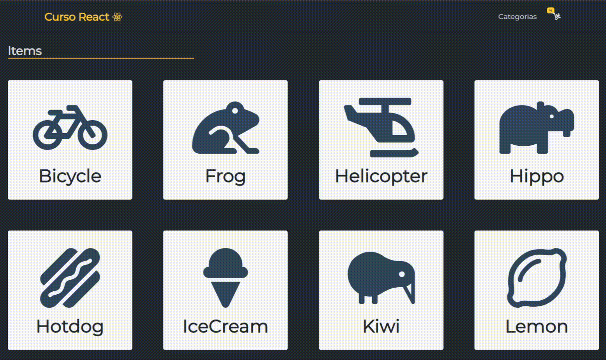

# Trabajo Practico React

_Trabajo final del curso de React de CodeHouse 2021. La consigna era crear un e-commerce utilizando React y una base de datos Firebase_

## Consinga

Desarrollarás una app de un e-commerce para poder vender productos de un rubro a elección.

### User story:

- Un usuario debe poder ingresar, navegar por los productos e ir a sus detalles.
- Desde el detalle se debe poder ver la descripción, foto y precio e ingresarlo al carrito.
- Una vez que el carrito tenga al menos un producto, se deberá visualizar un listado compacto de la orden con el precio total.
- Al ingresar su nombre, apellido, teléfono e e-mail (ingresándolo dos veces para corroborar que sea correcto), debe activarse el botón de ‘realizar compra’.
- Al clickear ‘realizar compra’ debe guardarse en la base de datos una orden que tenga todos los productos, la fecha y dar feedback del número de orden.



---
## Pre-Requisitos 📋

##### Node instalación enOS X

Necesitarás usar una Terminal. En OS X, puede encontrar el terminal predeterminado en ` /Applications/Utilities/Terminal.app.`

Instale Homebrew si aún no lo ha hecho con el siguiente comando. 

```
$ ruby -e "$(curl -fsSL https://raw.github.com/Homebrew/homebrew/go/install)"
```

luego deberias poder ejecutar

```
brew install node
```

##### Node instalación en Linux

```
sudo apt-get install python-software-properties
sudo add-apt-repository ppa:chris-lea/node.js
sudo apt-get update
sudo apt-get install nodejs
```

##### Node instalación en Windows

ingresa al sitio oficial de [node.js](https://nodejs.org/en/)  descarga el instalador.


_Debería poder ejecutar el siguiente comando después del procedimiento de instalación_

```
$ node --version
v14.15.4
```

```
$ npm --version
6.14.10
```

### Installation and Setup Instructions 🔧

```
$ git clone https://github.com/manurua123/CursoReact/
$ cd TrabajoPractico
$ npm install
```

_iniciar el servidor:_

```
npm start
```

_ingresar a la app:_

```
localhost:3000
```

## Languages & tools

- [React](https://reactjs.org/)
- [Bootstrap ](https://getbootstrap.com/)
- [Firebase ](https://firebase.google.com/)
---
## Gracias 🎁

- [Harol Thomas Cesar Reyes](https://github.com/HaroldReyes/ )- Profesor
- Marcos Vidal - Tutor
